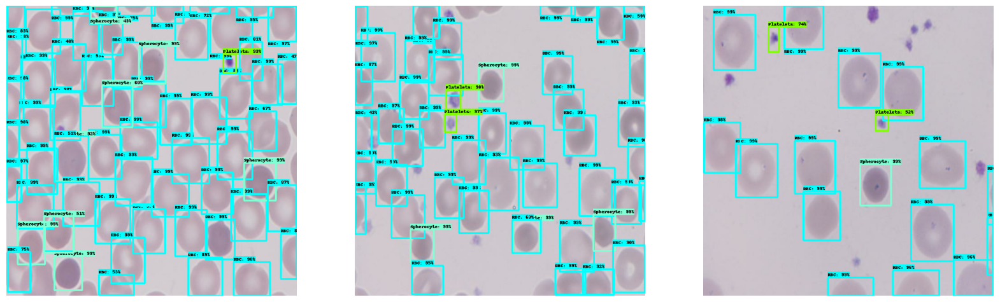

# Spherocytosis MaskRCNN Detection

An intelligent tool leveraging Mask R-CNN in TensorFlow for the early detection of Hereditary Spherocytosis and related blood disorders.

## Table of Contents

1. [Introduction](#1-introduction)
2. [Hereditary Spherocytosis (HS)](#2-hereditary-spherocytosis-hs)
3. [MaskRCNN Model Overview](#3-maskrcnn-model-overview)
4. [Dataset](#4-dataset)
5. [References](#5-references)
6. [Model Details](#6-model-details)

## 1. Introduction

Welcome to the Spherocytosis MaskRCNN Detection project. This initiative focuses on utilizing advanced AI techniques to streamline the identification of Hereditary Spherocytosis, providing a faster and more accessible diagnostic solution.

## 2. Hereditary Spherocytosis (HS)

Hereditary Spherocytosis (HS) is an inherited blood disorder characterized by fragile, spherical-shaped red blood cells (spherocytes), resulting in hemolytic anemia and associated health complications ([Nemours KidsHealth](https://kidshealth.org/en/parents/hereditary-spherocytosis.html)).

## 3. MaskRCNN Model Overview

The Mask R-CNN model employed in this project is trained on a dataset of MGG-stained blood smear images. It efficiently detects Hereditary Spherocytosis, automating a traditionally time-consuming process and providing a more efficient solution for both patients and healthcare professionals.

## 4. Dataset

The dataset (Dataset A) consists of 186 digital images of MGG-stained blood smears from five patients with Hereditary Spherocytosis. These high-resolution images, captured with a microscope (Olympus BX43) at 1,000x magnification and a digital camera (Olympus DP73), are in JPG format (RGB, 2,400 x 1,800 pixels). You can access the dataset [here](https://data.mendeley.com/datasets/c37wnbbd3c/1).

## 5. References

Explore related research for a comprehensive understanding:

- Delgado-Ortet M, Molina A, Alférez S, Rodellar J, Merino A. [A Deep Learning Approach for Segmentation of Red Blood Cell Images and Malaria Detection](https://www.ncbi.nlm.nih.gov/pmc/articles/PMC7517192/). Entropy (Basel). 2020 Jun 13;22(6):657.
- Naruenatthanaset K., Chalidabhongse T. H., Palasuwan D., Anantrasirichai N., Palasuwan A.. [Red Blood Cell Segmentation with Overlapping Cell Separation and Classification on Imbalanced Dataset](https://arxiv.org/abs/2012.01321). 2023. arXiv:2012.01321.
- Sadafi A., Bordukova M., Makhro A., Navab N., Bogdanova A., Marr C. [RedTell: an AI tool for interpretable analysis of red blood cell morphology](https://www.frontiersin.org/articles/10.3389/fphys.2023.1058720). Frontiers in Physiology Vol 14 (2023). DOI=10.3389/fphys.2023.1058720. ISSN=1664-042X.

## 6. Model Details

The project employs Mask R-CNN with Mobilenet V2 as the backbone model from the TensorFlow Model Garden. The dataset labeling was performed using Roboflow.

